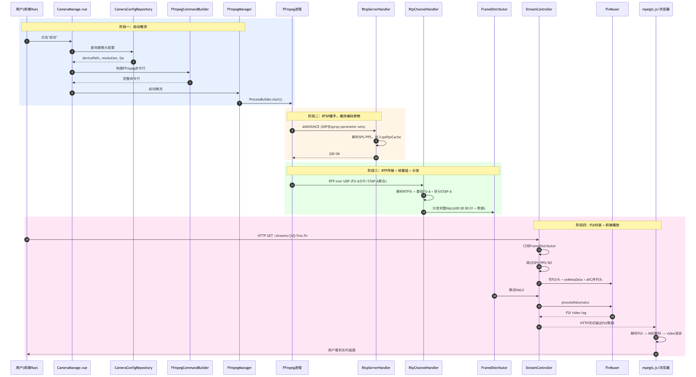

# SmartCamera 推流到播放完整流程

本文档用时序图和通俗语言解释：从点击"启动"到前端看到视频画面，整个过程经历了什么。

## 时序图



## 详细步骤拆解

### 第一阶段：启动推流（步骤 1-4）

1. **前端** `CameraManage.vue` 用户点击"启动"按钮，调用后端 API
2. `CameraConfigRepository` 从数据库读取该摄像头的配置（设备路径、分辨率、帧率、码率）
3. `FfmpegCommandBuilder` 把配置拼成一条完整的 FFmpeg 命令行
4. `FfmpegManager` 通过 `ProcessBuilder` 拉起 FFmpeg 进程，FFmpeg 开始从 USB 摄像头采集画面并用 libx264 编码

### 第二阶段：RTSP 握手（步骤 5-6）

5. FFmpeg 连接 RTSP 服务器，发送 `ANNOUNCE` 请求，SDP 体中包含 `sprop-parameter-sets`（Base64 编码的 SPS/PPS）
6. `RtspServerHandler.handleAnnounce()` 解析 SPS/PPS，存入 `spsPpsCache`，供后续 FLV 序列头使用

### 第三阶段：RTP 数据传输（步骤 7）

7. FFmpeg 通过 RTP over UDP 推送编码后的 H.264 数据：
   - 大帧被拆成多个 **FU-A 分片**，由 `RtpChannelHandler` 重组
   - 多个小 NALU 聚合成一个 **STAP-A 包**，由 `RtpChannelHandler` 拆分
   - 每个完整 NALU 加上 `00 00 00 01` 起始码

### 第四阶段：帧分发（步骤 8）

8. `FrameDistributor` 把每个 NALU 投递给所有订阅者（目前只有 `StreamController`）

### 第五阶段：FLV 封装（步骤 9）

9. `StreamController.streamFlv()` 收到 NALU 后：
   - 写 FLV 头 + onMetaData 脚本标签
   - 写 AVC 序列头（用缓存的 SPS/PPS）
   - 每帧通过 `FlvMuxer` 打包成 FLV video tag，实时 flush 到 HTTP 响应流
   - 前端 mpegts.js 收到 FLV 数据，解析后喂给浏览器 MSE 解码器，最终渲染到 `<video>` 标签

## 各类职责总结

| 类名 | 一句话职责 |
|------|-----------|
| `CameraManage.vue` | 管理界面，点"启动/停止"触发推流 |
| `Monitor.vue` / `VideoPlayer.vue` | 前端播放页面，用 mpegts.js 拉 FLV 流 |
| `CameraConfigRepository` | 从数据库读摄像头的分辨率、帧率等配置 |
| `FfmpegCommandBuilder` | 把配置拼成一条 FFmpeg 命令行 |
| `FfmpegManager` | 拉起 FFmpeg 进程，监控退出、自动重试 |
| `RtspServer` / `RtspServerHandler` | 接收 FFmpeg 的 RTSP 连接，缓存 SPS/PPS |
| `RtpServer` | 绑定 UDP 端口接收 FFmpeg 的 RTP 数据包 |
| `RtpChannelHandler` | 解析 RTP，重组 FU-A 分片，还原完整 H.264 NALU |
| `FrameDistributor` | 发布-订阅中心，把 NALU 分发给所有订阅者 |
| `FlvMuxer` | 把 H.264 NALU 打包成 FLV 格式（浏览器能播的容器） |
| `H264Parser` | 识别 NALU 类型（IDR/SPS/PPS/P-frame/SEI 等） |
| `StreamController` | FLV 流 HTTP 端点，串联所有组件完成实时流输出 |

## 关键数据格式变化

```
USB 摄像头原始画面
  ↓ (FFmpeg 采集)
YUV 像素数据
  ↓ (libx264 编码)
H.264 NALU (00 00 00 01 + NAL头 + 数据)
  ↓ (RTP 协议封装)
RTP 数据包 (UDP 传输，大帧被拆成 FU-A 分片)
  ↓ (RtpChannelHandler 重组)
完整 H.264 NALU (带起始码)
  ↓ (FlvMuxer 转换)
FLV video tag (FLV头 + tag头 + 长度前缀 + NALU数据)
  ↓ (HTTP StreamingResponseBody 输出)
浏览器 <video> 标签画面
  ↓ (mpegts.js 解析 + MSE 解码)
用户看到的实时视频
```
